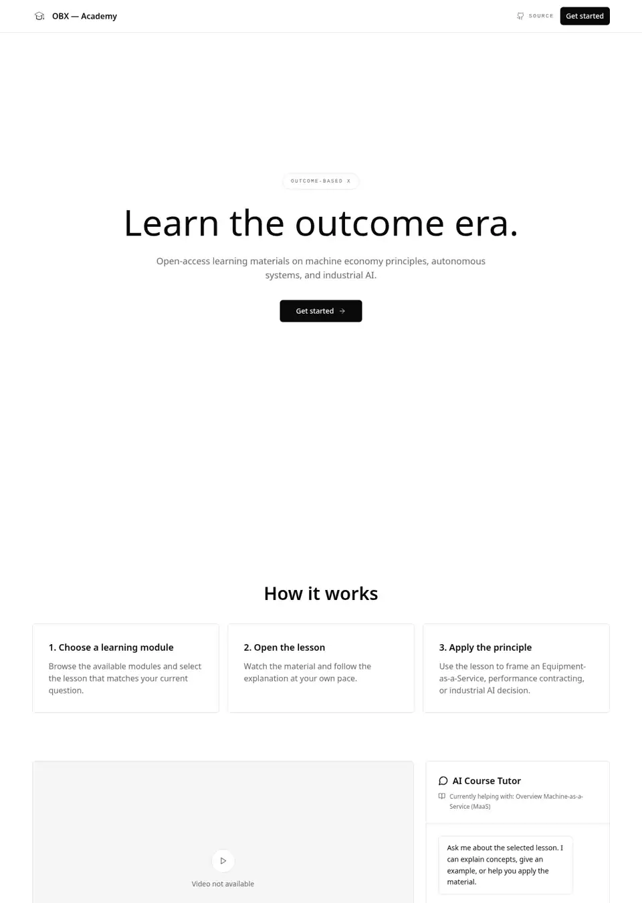

# OBX — Academy

Open-access learning for the outcome era: Machine-as-a-Service, outcome-based business models, autonomous systems, and industrial AI.

[Live app](https://www.luisprato.com/training) · [Luis Prato](https://www.luisprato.com)



## Overview

OBX Academy is a standalone learning app for industrial leaders, operators, and builders exploring the shift from selling equipment to delivering measurable outcomes. The repository runs without an account, API key, or backend.

The course library is bundled locally as static data, making the project easy to study, adapt, and host anywhere.

## Features

- 8 learning modules and 16 structured lessons
- Accordion course navigation and lesson switching
- Responsive lesson player with privacy-enhanced YouTube support
- Progress-oriented, distraction-free black-and-white interface
- Fully client-side course catalogue in `src/data/academyContent.ts`
- No account, database, or environment variables required

> The AI Course Tutor available on the live website is intentionally excluded. It requires protected server-side AI credentials that must not be shipped in a public repository.

## Run locally

**Requirements:** Node.js 18 or later and npm.

```bash
git clone https://github.com/luis-prato/obx-academy.git
cd obx-academy
npm install
npm run dev
```

Open the local address printed in the terminal.

## Production build

```bash
npm run build
npm run preview
```

The optimized output is generated in `dist/`.

## Project structure

```text
src/
├── components/       Academy interface and shared UI
├── data/             Bundled module and lesson content
├── pages/            Academy page
└── index.css         Global visual system
```

## Technology

React 18 · TypeScript · Vite · Tailwind CSS · React Router

## License

Released under the [MIT License](LICENSE). Course content remains attributable to Luis Prato.
